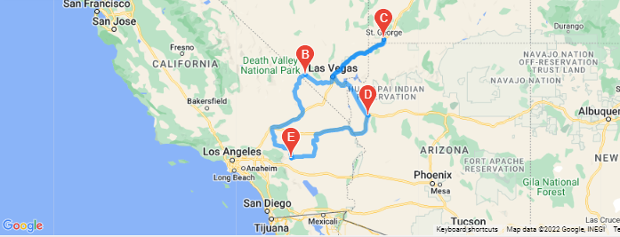
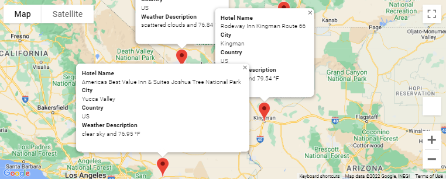

# World_Wheather_Analysiser
## Purpose
As technology advances and information becomes more readily avalable to everyone, new and exciting opportunities are available.  
In this project we help a user plan their next vacation based on their preferred minimum and maximum temperature, and create a route for 4 ctites with hotel stops and information.
### Technology and services used
- openweathermaps.org
- googlemaps.com
- Jupyter notebook
- Pandas
### Results
These are some of the results:  

